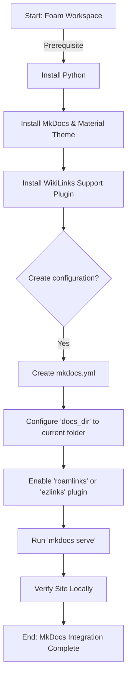

# Migrating Foam to MkDocs

This guide summarizes the steps to migrate or apply **MkDocs** to your Foam workspace, effectively replacing the default Jekyll-based static site generator suitable for standard Foam templates.

## Summary

1.  **Environment Setup**: Ensure Python is installed.
2.  **Installation**: Install `mkdocs` and the popular `mkdocs-material` theme.
3.  **Foam Compatibility**: Install a plugin to handle standard Foam `[[wikilinks]]`.
4.  **Configuration**: Create a `mkdocs.yml` file to define your site structure and plugins.
5.  **Deployment**: Build or serve the site locally.

## Flow Chart



## Detailed Steps

### 1. Install Dependencies
Open your terminal and run:
```bash
pip install mkdocs mkdocs-material mkdocs-ezlinks-plugin
```
*Note: `mkdocs-ezlinks-plugin` (or similar) is crucial for converting Foam's `[[link]]` syntax to HTML links.*

### 2. Create `mkdocs.yml`
Create a file named `mkdocs.yml` in the root of your workspace (`d:\Notes\FoamNotes\`) with the following content:

```yaml
site_name: My Foam Notes
theme:
  name: material

# Point MkDocs to your notes. 
# If your notes are in the root, use '.' or specific folder like 'docs' if structured that way.
docs_dir: . 

plugins:
  - search
  - ezlinks:
      wikilinks: true
```

*Warning: If your `docs_dir` is `.`, MkDocs will process ALL files. It is often cleaner to move all notes into a subfolder (e.g., `notes/`) and set `docs_dir: notes`.*

### 3. Run Locally
```bash
mkdocs serve
```
Visit `http://127.0.0.1:8000` to see your new site.
